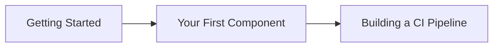

# Tutorials

**Learning-oriented lessons to get you started with GitLab CI/CD Components**

Tutorials are designed to help you learn by doing. They take you through a series of steps to complete a meaningful project, helping you understand the fundamentals along the way.

## What you'll learn

These tutorials will teach you:

- The basics of GitLab CI/CD components
- How to create your first component
- Building complete CI/CD pipelines using components
- Best practices for component development

## Available Tutorials

### [Getting Started](/tutorials/getting-started)
Your first introduction to GitLab CI/CD components. Set up your environment and understand the basic concepts.

**Duration:** ~15 minutes
**Prerequisites:** GitLab account, basic Git knowledge

### [Your First Component](/tutorials/first-component)
Create a simple but functional CI/CD component from scratch and learn the component structure.

**Duration:** ~30 minutes
**Prerequisites:** Getting Started tutorial

### [Building a CI Pipeline](/tutorials/building-pipeline)
Compose multiple components together to build a complete CI/CD pipeline for a real application.

**Duration:** ~45 minutes
**Prerequisites:** Your First Component tutorial

## Learning Path

## Tips for Learning

- **Follow along:** Don't just read - actually perform each step
- **Experiment:** Try modifying the examples to see what happens
- **Take breaks:** Complex concepts need time to sink in
- **Ask questions:** Use the community resources if you get stuck

Ready to begin? Start with [Getting Started](/tutorials/getting-started)!
